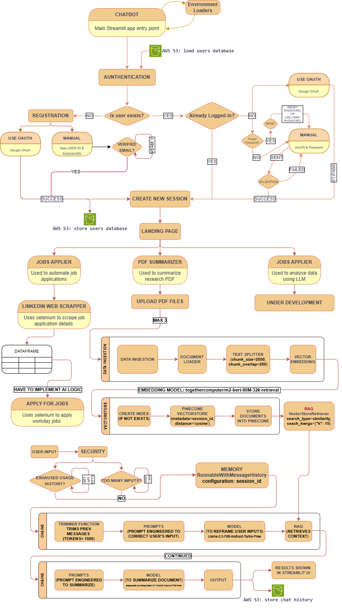

# LangChain Streamlit ChatBot

A scalable, modular, and production-ready chatbot platform powered by **LangChain**, **Streamlit**, and cloud-based **LLMs** (via Together AI). Designed for extensibility, this platform supports advanced features like document summarization, LinkedIn job automation, vector-based retrieval, and memory-aware multi-agent systems.

---

## 🔥 Key Features

- **LLaMA 3 and DeepSeek models** integrated via Together API for robust inference  
- **Streaming token-level output** for real-time assistant responses  
- **Modular architecture** supporting plug-and-play models, chains, memory, and retrievers  
- Built-in support for:
  - LangChain agents and chaining
  - Document ingestion, vector search (RAG), and summarization
  - Resume/job data parsing with automated job application workflows
  - Multimodal readiness (PDFs, images, text; OCR support upcoming)
  - Custom tool and model orchestration logic

---

## 🗺️ Architecture Overview
Below is the system flow of the application from user input to model orchestration:



---
## 🧱 Project Structure

```bash
LLMCHATBOT/
├── ChatBotApp.py                        # 🚀 Main Streamlit app entry point for running the entire chatbot UI and logic
├── .env                                 # 🔐 Environment variables for API keys, DB paths, credentials, etc.
├── .gitignore                           # 🚫 Specifies intentionally untracked files to ignore in Git
├── requirements.txt                     # 📦 Lists all Python dependencies required to run the project
│
├── .streamlit/
│   └── config.toml                      # ⚙️ Configuration for Streamlit runtime behavior (e.g., theme, server settings)
│
├── ai/
│   └── pdf_summarizer/
│       ├── chains/
│       │   └── Chain.py                 # 🧩 Defines custom chains using RunnableLambda, RunnableSequence, and message history components
│       ├── data_ingestion/
│       │   ├── DataLoaders.py          # 📄 Loads documents from PDFs and extracts metadata using PDFPlumber and DocumentLoader
│       │   ├── DocumentSplitters.py    # ✂️ Splits documents into chunks for LLM using RecursiveCharacterTextSplitter
│       │   └── VectorEmbeddings.py     # 🔍 Generates embeddings using "togethercomputer/m2-bert-80M-32k-retrieval"
│       ├── memory/
│       │   └── Memory.py               # 💾 Manages conversation history: saves, retrieves, and syncs memory with S3
│       ├── models/
│       │   ├── ModelLoader.py          # 📥 Loads LLM models such as LLaMA3 and DeepSeek via APIs
│       │   └── OutputParsers.py        # 🔎 Extracts and parses model outputs into structured formats
│       ├── prompts/
│       │   └── Prompts.py              # 🧠 Stores prompt templates for CoT reasoning, summarization, and critique generation
│       ├── rag/
│       │   └── Retrivers.py            # 🔁 Builds retrieval system (RAG) using similarity search (top-k=15)
│       ├── security/
│       │   └── api_key_generator.py    # 🔑 Validates API keys and enforces rate limits (5 req/min, 1000 total)
│       ├── tools/
│       │   └── ModelConnections.py     # 🔗 Builds pipelines: parses thoughts, connects chains, merges results
│       └── vectorstore/
│           └── VectorStore.py          # 📦 Handles persistent vector DBs Pinecone (create, retrieve, delete vector stores)
│
├── components/
│   ├── linkedin_automation/
│   │   ├── jobs_applier_selanium/
│   │   │   ├── ChromeJobsApplier.py    # 🤖 Automates job applications using Chrome Selenium driver
│   │   │   ├── data/
│   │   │   │   └── configurations.py   # ⚙️ Contains settings and constants for Selenium job applier
│   │   │   ├── helpers/
│   │   │   │   ├── ApplyForJobs.py     # 🔁 Navigates and fills job application forms
│   │   │   │   ├── DataPreprocess.py   # 🧹 Preprocesses resumes and job data before submission
│   │   │   │   ├── LoginPage.py        # 🔐 UI and logic for job portal login
│   │   │   │   ├── myExperiencePage.py # 🧾 Manages and autofills user experience fields
│   │   │   │   └── myInformationPage.py# 📇 Handles personal information entry and validation
│   │   │   ├── notification/
│   │   │   │   └── alert.mp3           # 🔔 Sound alert played during key events (e.g., when manual authentication required)
│   │   ├── ui/
│   │   │   ├── ConfirmRefixValues.py  # ✅ Checks and fixes data before form submission
│   │   │   ├── ExternalJobDetails.py  # 🌐 Scrapes job details from external platforms
│   │   │   ├── LinkedInJobDetails.py  # 📄 Extracts LinkedIn-specific job data
│   │   │   ├── LinkedInMain.py        # 🧭 Runs the complete LinkedIn job application loop
│   │   │   ├── LoginPage.py           # 🔐 Front-end login flow in LinkedIn
│   │   │   └── ResumeUploader.py      # 📤 Manages resume file upload and verification
│   │   ├── web_scrapper_selanium/
│   │   │   ├── LinkedInApplier.py     # 📋 High-level job applier logic orchestrator
│   │   │   └── helpers/
│   │   │       ├── AppLogin.py        # 🔐 Auto-login routines for Selenium browser
│   │   │       ├── ApplyJobFilters.py # 🧮 Applies filters on job search interface
│   │   │       ├── FillJobFilters.py  # 📝 Inputs user-selected filters into UI fields
│   │   │       ├── JobSearch.py       # 🔍 Executes job searches via UI
│   │   │       ├── PageChange.py      # 📄 Handles pagination through search results
│   │   │       ├── ScrapeData.py      # 🧾 Extracts job data for processing
│   │   │       ├── ScrapeHelpers.py   # 🛠️ Utility functions for parsing, handling DOM elements
│   │   │       └── TerminateProcess.py# ❌ Gracefully closes Selenium sessions and cleanup
│
│   ├── main_ui/
│   │   ├── Animation2.json             # 🎞️ JSON-based Lottie animation for loading or transition effects
│   │   ├── background.css              # 🎨 Global styles for Streamlit interface
│   │   └── Sidebar.py                 # 📚 Controls sidebar content and navigation structure
│
│   ├── pdf_summarizer/
│   │   ├── PDFSummarizer.py           # 📄 Main entry to summarize PDFs using the backend RAG pipeline
│   │   └── ui/
│   │       ├── ChatHistory.py         # 📜 Displays chat message log within UI
│   │       ├── ContainerLayout.py     # 📦 Arranges Streamlit UI components in containers
│   │       ├── Expander.py            # ⬇️ Toggles visibility of UI sections
│   │       ├── StatusBar.py           # 📊 System status display and notifications
│   │       ├── UserInput.py           # 🎤 Accepts user queries and input for the summarizer
│   │       └── avatar/
│   │           ├── ai.png             # 🤖 Visual avatar representing the AI
│   │           └── human.png          # 👤 Visual avatar representing the user
│
├── utils/
│   ├── aws_utils.py                   # ☁️ Upload/download data to AWS S3 buckets
│   ├── env_loaders.py                 # ⚙️ Load .env and environment variables into app context
│   ├── env_reloaders.py               # ♻️ Force reload of environment variables during runtime
│   ├── global_variables.py            # 📌 Stores reusable constants (e.g., paths, limits)
│   ├── models_used.json               # 📄 JSON metadata for which models are currently used
│   ├── logger/
│   │   ├── EventLogger.py             # 🪵 Log events, errors, and user interactions
│   │   └── SessionId.py               # 🧾 Generates and manages user/session IDs
│   └── login_page/
│       └── streamlit_login_auth_ui/
│           ├── login.py               # 🔐 Login form logic using Streamlit widgets
│           ├── login_utils.py         # 🛠️ Helper functions for validating login credentials
│           └── widgets.py             # 🧩 Custom login widgets for interactive UI
```

---

## ⚙️ Getting Started

### 1. Install Dependencies

```bash
pip install -r requirements.txt
```
> Ensure you are using Python 3.10 or later, and have access to the internet for downloading models and APIs.

---

### 2. Configure Environment

Create a `.env` file in the project root with your keys and configuration:

```env
# 🔐 API Keys
LANGCHAIN_API_KEY=your-langchain-key
TOGETHER_API_KEY=your-together-key
AWS_ACCESS_KEY_ID=your-aws-access-key
AWS_SECRET_ACCESS_KEY=your-aws-secret-key

# 🌍 Environment Settings
LANGCHAIN_TRACING_V2=true
LANGCHAIN_PROJECT=chatbot-app
LANGSMITH_ENDPOINT=https://api.smith.langchain.com
AWS_DEFAULT_REGION=ap-south-1
MY_S3_BUCKET=my-chatbot-bucket

# 🔧 Vector DB
PINECONE_API_KEY=your-pinecone-key
PINECONE_INDEX=my-index
PINECONE_REGION=us-east-1

# 📧 Email Alerts (optional)
SMTP_SENDER_EMAIL=your-email
SMTP_APP_PASSWORD=your-app-password

# 🌐 OAuth
GOOGLE_CLIENT_ID=client-id.apps.googleusercontent.com
GOOGLE_CLIENT_SECRET=your-google-secret

# 💼 Company Info
COMPANY_NAME=MyCompany
```

---

### 3. Run the App

```bash
streamlit run ChatBotApp.py
```
> This launches the full PDF summarizer, chat memory, and LinkedIn job automation UI.

---

## 🧭 Roadmap

### ✅ Implemented Features

| Module                     | Description                                                                 |
|----------------------------|-----------------------------------------------------------------------------|
| **PDF Summarizer**         | Upload and summarize PDF files using vector search + RAG                   |
| **Chat History & Memory**  | Stores and retrieves chat logs using S3 and memory chain mechanisms        |
| **LinkedIn Automation**    | Automate job applications on LinkedIn and external sites via Selenium      |
| **RAG Retrieval**          | Retrieves context using similarity search (top-k = 15) for grounded answers|
| **Resume Uploader**        | Upload resumes and auto-populate job application forms                     |
| **Model Orchestration**    | Dynamically loads LLMs like LLaMA 3, DeepSeek via ModelLoader              |
| **API Key Management**     | Handles per-user API keys with rate-limiting (5 requests/min, 1000 total)  |
| **Multi-Agent Chaining**   | Connects LLM agents using chains, memory, prompts, and retrievers          |
| **Streamlit UI**           | Interactive UI with sidebar, expanders, chat interface, status bar         |
| **Job Filtering Engine**   | Applies and manages custom job filters during automated applications       |

### 🛠️ Planned Features

| Feature                          | Description |
|----------------------------------|-------------|
| **OCR-Enhanced PDF Summarizer**  | Add OCR pipeline to extract text from scanned PDFs and image-based documents. |
| **Data Analysis Bot**            | Launch LangChain agent that connects to Amazon RDS, queries data, and returns plots/insights in natural language. |
| **AI-Powered Resume Builder**    | Generate custom resumes and cover letters using LLMs tailored to each job description. |
| **Realtime Progress Logs**       | Show scraping and application logs in real-time within Streamlit UI. |
| **Admin Dashboard**              | Dashboard to track API usage, errors, and system logs. |
| **Conversation Export**          | Export user conversations to downloadable PDF/text format. |
